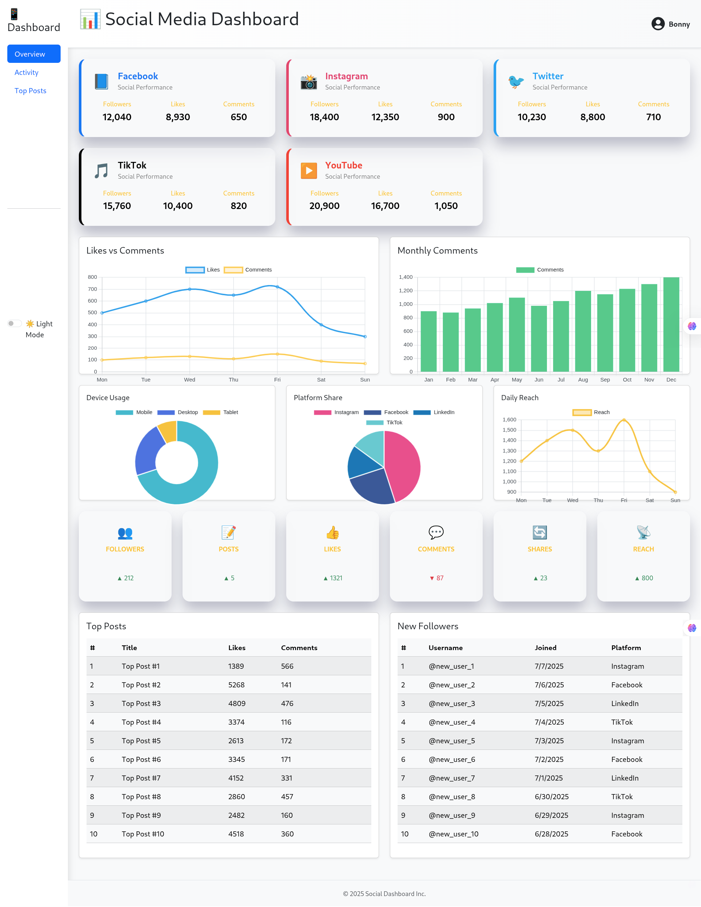

# 📊 Social Media Dashboard

A modern, fully responsive social media analytics dashboard built with **Vite**, **React**, **Bootstrap**, and **Chart.js**. This dashboard visualizes key performance indicators (KPIs), engagement trends, and platform-specific insights using various interactive graphs, tables, and cards.

---

## 🚀 Features

- 🌗 **Light/Dark Mode Toggle**
- 🧩 **Sidebar Navigation** with icons and theme switch
- 📱 **Platform Cards** (Facebook, Instagram, Twitter, TikTok, YouTube) with icons, follower stats, likes, comments
- 📈 **Activity Charts** (Line, Bar, Pie, Doughnut, Area)
- 🧮 **Overview Cards** (Followers, Reach, CTR, Ad Spend, etc.)
- 📝 **Top Posts & New Followers Tables**
- 🧊 **Glassmorphism and 3D UI Styling** using Bootstrap + custom CSS
- ⚡ **Built with Vite for lightning-fast dev experience**
- 📱 Fully **responsive layout** for desktop, tablet, and mobile

---

## 🛠️ Tech Stack

| Technology      | Description                       |
|-----------------|-----------------------------------|
| React           | Frontend library                  |
| Vite            | Blazing-fast dev server           |
| Bootstrap 5     | Responsive styling + layout       |
| Chart.js        | Interactive chart rendering       |
| Framer Motion   | Animation (optional)              |
| Custom CSS      | Glass effect, shadows, colors     |

---

## 📷 Screenshot

🧪 Getting Started
1. Clone the repository
bash
Copy
Edit
git clone https://github.com/your-username/social-media-dashboard.git
cd social-media-dashboard
2. Install dependencies
bash
Copy
Edit
npm install
3. Start development server
bash
Copy
Edit
npm run dev
4. Build for production
bash
Copy
Edit
npm run build

###📊 Charts Included
Likes vs Comments — Line Chart

Monthly Comments — Bar Chart

Device Usage — Doughnut

Platform Share — Pie

Daily Reach — Area Chart

###📦 Data Sources
All data is dummy/fake for demonstration purposes and comes from:

src/data/dummyData.js

###🧠 Future Improvements
Add login/authentication

Connect to real-time API (Facebook, Instagram, etc.)

Add export options (PDF, CSV)

Notifications and alerts panel

###🙌 Credits
React & Vite by Meta & Vite team

Bootstrap by Twitter

Chart.js by Chart.js team

Icons via Bootstrap Icons and emojis

Developed by Boniface Nderitu (Bonny MKuu)

# React + Vite

This template provides a minimal setup to get React working in Vite with HMR and some ESLint rules.

Currently, two official plugins are available:

- [@vitejs/plugin-react](https://github.com/vitejs/vite-plugin-react/blob/main/packages/plugin-react) uses [Babel](https://babeljs.io/) for Fast Refresh
- [@vitejs/plugin-react-swc](https://github.com/vitejs/vite-plugin-react/blob/main/packages/plugin-react-swc) uses [SWC](https://swc.rs/) for Fast Refresh

## Expanding the ESLint configuration

If you are developing a production application, we recommend using TypeScript with type-aware lint rules enabled. Check out the [TS template](https://github.com/vitejs/vite/tree/main/packages/create-vite/template-react-ts) for information on how to integrate TypeScript and [`typescript-eslint`](https://typescript-eslint.io) in your project.

